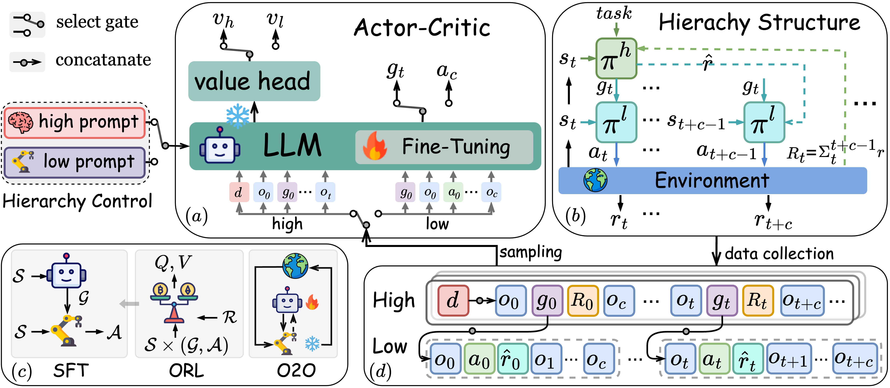

<div align="center">


<h1 style="display: flex; justify-content: center; align-items: center; gap: 5px; margin: 0;">
  Divide and Conquer: Grounding LLMs as Efficient Decision-Making Agents via Offline Hierarchical Reinforcement Learning
</h1>

Zican Hu<sup>12</sup>, Wei Liu<sup>3</sup>, Xiaoye Qu<sup>2</sup>, Xiangyu Yue<sup>4</sup>, Chunlin Chen<sup>1</sup>, Zhi Wang<sup>12</sup><sup>[✉](zhiwang@nju.edu.cn)</sup>, Yu Cheng<sup>4</sup><sup>[✉](chengyu@cse.cuhk.edu.hk)</sup>

<sup>1</sup>Nanjing University  <sup>2</sup>Shanghai AI Laboratory  <sup>3</sup>The Hong Kong University of Science and Technology  <sup>4</sup>The Chinese University of Hong Kong


## **Overview**



## **Citation**

If you find our paper useful, please consider to star this repository and cite it:

> @inproceedings{hu2024divide,
>       title={Divide and Conquer: Grounding LLMs as Efficient Decision-Making Agents via Offline Hierarchical Reinforcement Learning}, 
>       author={Zican Hu and Wei Liu and  Xiaoye Qu and Xiangyu Yue and  Chuniln Chen and Zhi Wang and Yu Cheng},
>       year={2025},
>       booktitle={Proceedings of the 42st International Conference on Machine Learning}
> }

## **Instructions**

GLIDER tested on two benchmark tasks ScienceWorld and AlfWorld. Follow the instructions in the [[ScienceWorld ]](https://github.com/allenai/ScienceWorld)[[AlfWorld]](https://github.com/alfworld) to install.
Create a virtual environment using conda, and see `requirments.txt` file for more information about how to install the dependencies.

```shell
conda create -n acorm python=3.10 -y
conda activate glider
pip install -r requirements.txt
```

## **experiment**

### SFT

Run SFT training with the following script with corresponding config in ```./config/glider_bc.json```:

```shell
srun -p PARTITION_NAME \  # Specify your partition
     -w NODE_NAME \       # specify worker node
     -c NUM_CPUS \				# Specify CPU constraints
     deepspeed --num_gpus NUM_GPUS --master_port=PORT_NUMBER train_glider_bc.py
```

Or simply run the shell file:

```shell
sh glider_bc.sh
```

### ORL

Set collection data mode in ```./config/collection.json``` 

```shell
srun -p PARTITION_NAME \
 		 -w NODE_NAME\
 		 -c NUM_CPUS \
     deepspeed --num_gpus 1 --master_port=PORT_NUMBER glider_data_collection.py
```

 Then run ORL training with the following script with corresponding config in ```./config/glider_awac.json```:

```shell
sh glider_awac.sh 
```

### O2O

Set task name and check point path in ```./config/glider_o2o.json``` , then run O2O training :

```shell
srun -p PARTITION_NAME \  # Specify your partition
     -w NODE_NAME \       # specify worker node
     -c NUM_CPUS \				# Specify CPU constraints
     deepspeed --num_gpus NUM_GPUS --master_port=PORT_NUMBER train_glider_online.py
```

### Evaluation

Set evaluation setting in ```./config/eval.json``` , then run the shell file:

```shell
sh eval.sh
```

